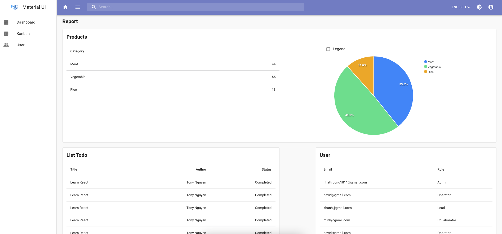
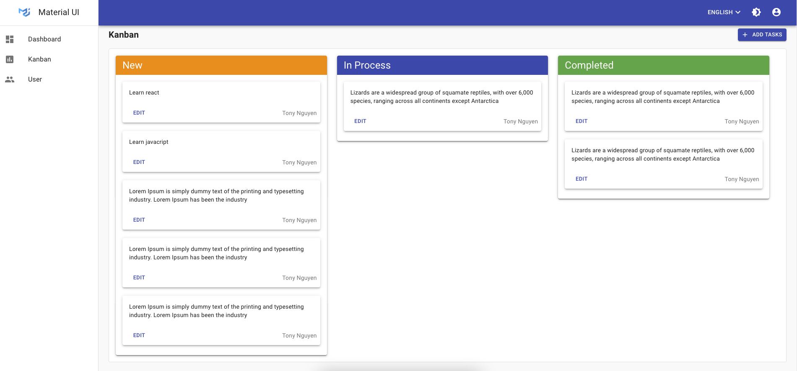

# React Boilerplate Material UI

A simple react boilerplate apps built with React Typescript, redux and Material Ui.

## Working application

Check out the live application -> https://xenodochial-tereshkova-b7625c.netlify.app/

### Login


### Dashboard



### Kanban



## Stack

### FE

- axios
- react typescript
- contextApi
- redux
- redux-thunk

### Features

- i18n
- dark mode
- react error boundary
- axios interceptor
- cancel request
- authentication guards
- @casl/ability role
- role & permission based route.
- wavesurfer

### CI/CD

- docker
- bitbucket pipeline

### Testing

- Jest
- Enzyme
- E2E

### UI Component

- material UI

### Pattern design

- atomic design

### Tools

- eslint
- prettier
- husky
- lint-staged

## Git replacing LF with CRLF

```
$ git config --global core.autocrlf false
$ git rm --cached -r .
$ git reset --hard
```

## Config VSCode

### Install extensions

- eslint
- tslint
- prettier
- editorConfig for VSCode

### Edit settings.json file

Windows: Go to File -> Preferences -> Settings or `Ctrl + ,`

Adding in the settings.json file & create .vscode/settings.json in root project

```
{
  "files.associations": {
    "*.jsx": "javascriptreact"
  },
  "editor.insertSpaces": true,
  "editor.detectIndentation": false,
  "editor.formatOnSave": true,
  "editor.codeActionsOnSave": {
    "source.fixAll.eslint": true
  }
}
```

## Installation

```bash
# install node version
Please install at least v15.2.0 version node

# install npm version
Please install at least v7.0.10 version node
```

```bash
# install app's depndencie
$ npm install
```

## Scripts

```bash
# install typescript
$ npm install -g typescript
```

```bash
# dev server with PORT 3002 at http://localhost:3002/
$ npm start

# build for production with minify
$ npm run build

# run `lint` to tell you what is wrong code.
$ npm run lint

# run `format` to format all code based on your prettier and linting configuration.
$ npm run format
```

# Convention code

## Component's file name should be in Pascal Case.

Component names should be like ProductCard and not like productCard, product-card, etc. This way when we see a filename in Pascal Case, it is immediately clear that the file is a react component.

## Component having own folders should have a component file with the same name.

This way when we search for files, we don't get a list of <b>index.ts</b> but will receive the actual component files.

## Create an index.ts file in that component folder which export the named component.

```
import Product from './Product';
export default Product;
```

or

```
export { default } from './Product';
```

### Components which can be used in other project or reuse.

Components can be keep in `components/` folder (atom, molecules...). You can refer design system of Atomic Design.

https://bradfrost.com/blog/post/atomic-web-design/

## Hooks

When we want to share logic between two javascript functions, we will extract it to a third function. Both components and hooks are functions, so this work for them too.

A custom Hook is a javascript function whose name starts with `"use"` and that may call other hook. For example, `useTranslation` below is a custom hook:

```bash
# useTranslation.tsx
import { useTranslation } from 'react-i18next';
const useTranslate = () => {
  const { t: translate, i18n } = useTranslation();
  return { translate, i18n };
};
export default useTranslate;
```

## Helpers

Share an function logic for our app. It name should be in lowercase. For example, `sleep` below is a function.

```bash
# sleep.ts

export const sleep = time => new Promise(res => setTimeout(res, time));
```

## Directory sturcture code

### Group by folder

````
├── public/          #static files
│   ├── assets/      #assets
|   |    |── images  #images
|   |    |── fonts   #fonts
│   └── index.html   #html template
│
├── src/             #project root
|   |── actions/     #actions redux
|   |── apis/        #apis of feature
|   |── assets/      #assets file
|   |── components/  #common components reuse
│   ├── configs/     #configs project
│   ├── containers/  #containers source
|   |── context/     #contextApi
|   |── features/    #features of app
|   |── guards/      #guard permissions
│   ├── hooks/       #hooks source
|   |── layouts/     #common layouts
|   |── locales/     #multi languages
│   ├── models/      #define interface
|   |── reducers/    #reducers redux
|   |── routes/      #common routes
|   |── selectors/   #selectors redux
│   ├── services/    #services source
|   |── stores/      #stores redux
|   |── themes/      #themes app
│   ├── App.js
│   ├── App.test.js
│   ├── index.js

└── package.json```
````
